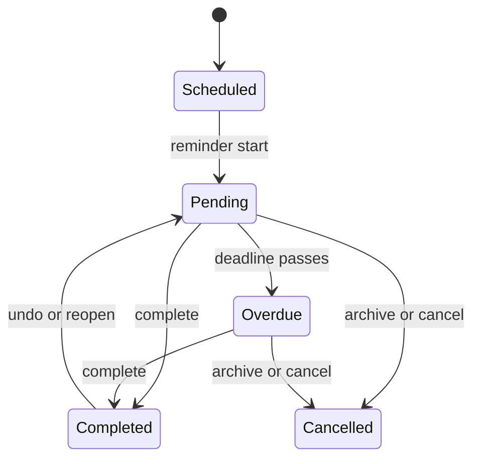

# Product specification: persistent reminders

Status: approved target product design. The checked-in application is still the
payment-oriented prototype described in [architecture.md](architecture.md).

## Product thesis

`zvenfit-reminder` is a dispatcher for personal and group obligations. A person
assigns a concrete thing that must be done, and the bot keeps reminding the
responsible person until the obligation is explicitly completed.

The product is not a calendar replacement or a general-purpose task tracker.
Its primary job is to make ownership, deadline, and current attention state
obvious.

## Goals

- Create one-off and recurring reminders without payment-specific assumptions.
- Assign clear responsibility while keeping group work visible.
- Repeat Telegram notifications until the current obligation is completed.
- Make overdue work and the next notification time easy to understand.
- Support private reminders without weakening group privacy.
- Preserve an auditable history of completion, snoozing, reassignment, and
  administrative actions.
- Export deadlines to Google Calendar, Apple Calendar, and Yandex Calendar.

## Non-goals

- Checklists, project boards, dependencies, subtasks, or workflow automation.
- File uploads, photo proof, or mandatory completion evidence.
- User-authored cron expressions.
- Outlook integration.
- Using a third-party calendar as the source of truth for completion state.

## Workspace and roles

A workspace represents one Telegram group. All domain keys and authorization
checks are scoped by `workspaceId`.

| Role | Capabilities |
| --- | --- |
| Owner | Manage roles and workspace settings; create and manage any group reminder; create private reminders for members. |
| Organizer | Create and manage group reminders; create private reminders for members; intervene in group reminder completion when necessary. |
| Member | View group reminders, act on assigned work, and create private reminders for themselves. |

Telegram administrator status does not implicitly grant an application role.
The owner explicitly grants organizer access inside the Mini App.

Telegram does not expose the complete group roster to bots, including bot
administrators. An owner or organizer can import up to ten users at a time with
Telegram's native user picker in the private bot chat. The picker is not scoped
to a group, so the backend verifies every selected user with `getChatMember`
against the workspace group before activating membership. Future joins and
group activity are observed automatically. Starting the bot is required only
when a member needs private notifications.

## Reminder content

Each reminder contains:

- a required short title;
- an optional description;
- an optional validated action URL;
- an optional amount stored in minor currency units plus an ISO currency code;
- group or private visibility;
- a creator;
- one responsible member or the `anyone` completion mode;
- optional watchers;
- a deadline and recurrence schedule;
- notification, quiet-hour, and escalation policies;
- lifecycle status: `active`, `paused`, or `archived`.

Amount and link fields are secondary details. They do not make a reminder a
special payment subtype.

## Visibility and responsibility

### Group reminders

- Group visibility is the default.
- The reminder and its current state are visible to all workspace members.
- Ordinary pings mention only the responsible person.
- A reminder normally has exactly one responsible person.
- In `anyone` mode, any active workspace member may complete it.

### Private reminders

- A member may create a private reminder only for themselves.
- An owner or organizer may assign a private reminder to any member.
- Only the creator and responsible person can see it.
- Notifications and escalation are delivered through private bot chats.
- A private reminder cannot be created until the responsible user has started
  the bot and a private chat is available.
- Owner or organizer status does not grant access to a private reminder created
  by somebody else.

### Watchers

- When the creator assigns another person, the creator becomes a watcher by
  default.
- Watchers are not mentioned by ordinary reminders.
- They are included after the escalation delay.
- Watchers can be changed by an owner, organizer, or reminder creator with
  sufficient permissions.

## Schedule model

The deadline and first notification time are separate concepts:

- **Deadline**: when the obligation should be completed and what calendars show.
- **Reminder start**: when Telegram notifications begin. It defaults to the
  deadline but may be configured before it.

Supported recurrence shapes:

- once at a concrete instant;
- daily;
- weekly on selected weekdays;
- monthly on a day of month or the final day of month;
- yearly on a calendar date;
- every `N` days, weeks, or months.

Schedules use local date/time components and an IANA timezone. A deadline may
have an exact time or be all-day. An all-day reminder starts notifying at the
workspace's default all-day time, initially 09:00, and becomes overdue at the
end of its local date. A requested day 29–31 that is absent in a month resolves
to that month's final day. A yearly 29 February deadline resolves to 28 February
in a non-leap year. The UI must preview upcoming occurrences before save.

On creation, recurring schedules select the next future local deadline. If
today's scheduled time has already passed, the first occurrence uses the next
recurrence. When advance notification should already have started for a future
deadline, the occurrence becomes pending immediately and the first ping is sent
as soon as quiet hours permit.

The schedule is stored as a validated, versioned discriminated specification,
not as user-entered cron. Example:

```json
{
  "version": 1,
  "frequency": "monthly",
  "startDate": "2026-08-13",
  "interval": 1,
  "timing": {
    "kind": "timed",
    "timeLocal": "18:00"
  },
  "day": {
    "type": "dayOfMonth",
    "value": 31,
    "overflow": "lastDay"
  }
}
```

## Occurrences and lifecycle

A recurring reminder is a definition; an occurrence is one concrete obligation
with its own deadline, state, delivery history, and completion record.



Only one incomplete occurrence may exist for a recurring reminder. If it is
still overdue when another schedule date passes, the existing occurrence keeps
running and no duplicate obligation is created. After completion, the next
schedule date is calculated normally.

Completed history is immutable except for an explicit reopen action recorded
in the audit log.

## Notification policy

Workspace defaults:

| Setting | Default |
| --- | --- |
| First notification | At the deadline |
| Repeat interval | Every 6 hours |
| Quiet hours | 22:00–08:00 workspace local time |
| First watcher escalation | 24 hours after deadline |
| Later watcher escalation | At most once per 24 hours |
| Stop condition | Explicit completion or cancellation |

Quick repeat presets are one hour, three hours, six hours, twelve hours, one
day, and a custom interval.

Notifications due during quiet hours move to 08:00. Missed intervals do not
accumulate. The next interval is measured from the actual delivery time. An
individual urgent reminder may explicitly ignore quiet hours.

### Snooze

For a group reminder, the responsible person, creator, owner, or organizer may
snooze the current occurrence. For a private reminder, only its responsible
person or creator may do so. Suggested choices are one hour, this evening,
tomorrow morning, and a custom instant.

Snooze changes only the next notification time. It does not move the deadline,
remove overdue state, or change the recurring reminder's base policy. After the
snoozed notification, the configured repeat interval resumes.

### Escalation

After 24 hours overdue, the next notification also mentions watchers. Later
watcher mentions happen no more than once per day. A reminder may override or
disable escalation.

## Completion and correction

- Completion takes one tap and has no confirmation dialog.
- The responsible person may complete an assigned reminder.
- For a group reminder, the creator, owner, or organizer may complete it on the
  responsible person's behalf.
- For a private reminder, only its responsible person or creator may complete
  it.
- In `anyone` mode, any active member may complete it.
- The actor and timestamp are always shown and audited.
- A ten-minute `Undo completion` action is available to the actors who could
  complete that reminder under the same visibility rules.
- An owner or organizer may reopen a group occurrence later from history; a
  private occurrence may be reopened by its creator.

## Editing a recurring reminder

Editing an active occurrence offers two scopes:

- **Only this occurrence** changes its deadline, responsible person, content,
  or notification policy without changing the series.
- **This and future occurrences** updates the reminder definition and the
  current incomplete occurrence. Completed history is unchanged.

Pausing stops current and future notifications. Resuming starts from the next
valid schedule date and does not create occurrences for dates missed during the
pause. Archiving permanently ends the series while preserving history. Normal
product flows never hard-delete reminder history.

## Telegram message lifecycle

There is one live Telegram message per active occurrence:

1. The bot sends a new message so Telegram produces a real notification.
2. After successful send, it removes the previous live message when Telegram
   permits deletion.
3. If deletion is unavailable, the bot removes its buttons and compacts its
   text so there is only one actionable message.
4. Snooze edits the current message in place.
5. Completion edits the current message to its final state and temporarily
   exposes `Undo completion`.
6. The Mini App, not chat history, is the canonical audit surface.

## Calendar strategy

The Mini App ships with native `Tasks` and `Plan` views. External integration is
read-only at first:

- a revocable, per-user secret ICS URL;
- deadlines only, never every Telegram retry;
- timed deadlines are transparent events that do not block availability;
- date-only deadlines are all-day events;
- links return to the reminder in the Mini App.

ICS targets are Google Calendar, Apple Calendar, and Yandex Calendar. Provider
refreshes are not real-time, so Telegram and the Mini App remain the source of
truth. Native Google OAuth synchronization is a later option only if editing
from Google Calendar becomes a demonstrated need.

## Product quality requirements

- All payloads, callback data, role checks, and schedule invariants are
  validated server-side.
- Every read and write is scoped by workspace.
- Duplicate occurrence creation and duplicate scheduled sends are prevented by
  database keys and serializable transactions.
- Light and dark themes, keyboard focus, safe-area insets, and reduced motion
  are supported.
- The primary create flow uses plain-language preview text instead of exposing
  storage or scheduler terminology.
